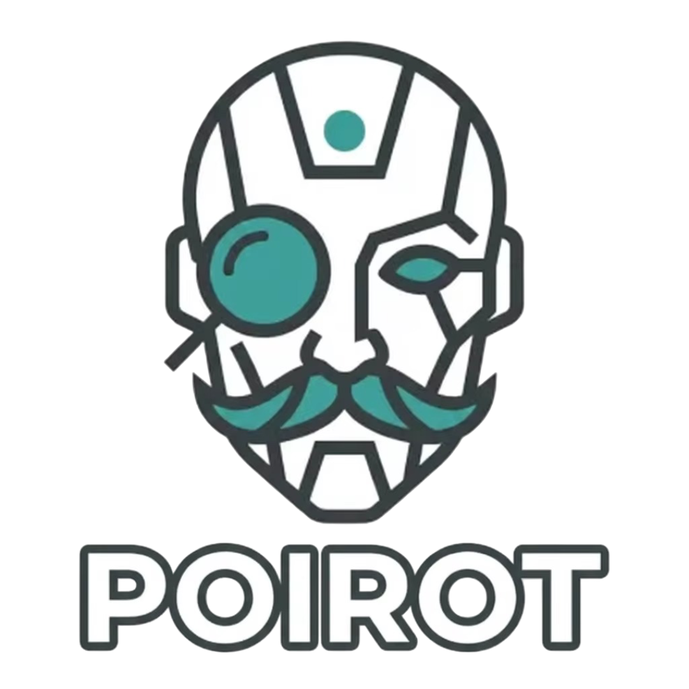

# POIROT (PrOfIling RObotics Tool)

<p align="center">
  
</p>

---

**POIROT** is a comprehensive profiling and monitoring framework for ROS 2 applications that provides detailed insights into function performance, resource consumption, energy usage and CO2 emissions. With its htop-like terminal interface, real-time data visualization and CSV recording capabilities, POIROT enables developers to optimize their robotic systems for performance and sustainability, acting as a keen investigator of code inefficiencies.

---

<div align="center">

[](https://opensource.org/license/apache-2)
[](https://github.com/mgonzs13/poirot/releases)
[](https://github.com/mgonzs13/poirot?branch=main)
[](https://github.com/mgonzs13/poirot/commits/main)

[](https://github.com/mgonzs13/poirot/issues)
[](https://github.com/mgonzs13/poirot/pulls)
[](https://github.com/mgonzs13/poirot/graphs/contributors)

[](https://github.com/mgonzs13/poirot/actions/workflows/python-formatter.yml?branch=main)
[](https://github.com/mgonzs13/poirot/actions/workflows/cpp-formatter.yml?branch=main)

| ROS 2 Distro |                                                                                                    Build and Test                                                                                                    |
| :----------: | :------------------------------------------------------------------------------------------------------------------------------------------------------------------------------------------------------------------: |
|   **Foxy**   |        [](https://github.com/mgonzs13/poirot/actions/workflows/foxy-build-test.yml?branch=main)         |
| **Galatic**  |  [](https://github.com/mgonzs13/poirot/actions/workflows/galactic-build-test.yml?branch=main)   |
|  **Humble**  | [](https://github.com/mgonzs13/poirot/actions/workflows/humble-build-test.yml?branch=main) |
|   **Iron**   |        [](https://github.com/mgonzs13/poirot/actions/workflows/iron-build-test.yml?branch=main)         |
|  **Jazzy**   |       [](https://github.com/mgonzs13/poirot/actions/workflows/jazzy-build-test.yml?branch=main)       |
|  **Kilted**  |     [](https://github.com/mgonzs13/poirot/actions/workflows/kilted-build-test.yml?branch=main)      |
| **Rolling**  |    [](https://github.com/mgonzs13/poirot/actions/workflows/rolling-build-test.yml?branch=main)    |

</div align="center">

## Table of Contents

- [Features](#features)
- [Installation](#installation)
- [Usage](#usage)
- [Demos](#demos)
  - [Quick Start Demo](#quick-start-demo)
  - [Running with TUI](#running-with-tui)
  - [Recording Data to CSV](#recording-data-to-csv)

## Features

- **Core Profiling Library (poirot)**: Automatic system detection, comprehensive metrics (timing, memory, I/O, energy, CO2), low overhead, ROS 2 integration.
- **Terminal User Interface (poirot_tui)**: Real-time table and graphs, interactive controls.
- **CSV Recorder (poirot_recorder)**: Records profiling data to CSV for analysis.
- **Demo Applications (poirot_demos)**: Examples for ROS 2 profiling.
- **Message Definitions (poirot_msgs)**: Custom ROS 2 messages for profiling data.

## Installation

```shell
cd ~/ros2_ws/src
git clone https://github.com/mgonzs13/poirot
cd ~/ros2_ws
rosdep install --from-paths src --ignore-src -r -y
colcon build
```

## Usage

1. **Add dependency in `package.xml`**:

   ```xml
   <depend>poirot</depend>
   ```

2. **Update `CMakeLists.txt`**:

   ```cmake
   find_package(poirot REQUIRED)

   add_executable(your_node src/your_node.cpp)
   target_link_libraries(your_node
     poirot::poirot
   )
   ```

3. **Instrument your C++ code**:

   ```cpp
   #include "rclcpp/rclcpp.hpp"
   #include "poirot/poirot.hpp"

   using namespace poirot;

   class MyNode : public rclcpp::Node {
   public:
     MyNode() : Node("my_node") {
       // Create timer, subscribers, etc.
       timer_ = create_wall_timer(
         std::chrono::seconds(1),
         std::bind(&MyNode::timer_callback, this));
     }

   private:
     void timer_callback() {
       PROFILE_FUNCTION();  // Automatically profiles this function

       // Your function logic here...
     }

     rclcpp::TimerBase::SharedPtr timer_;
   };

   int main(int argc, char* argv[]) {
     rclcpp::init(argc, argv);
     auto node = std::make_shared<MyNode>();
     rclcpp::spin(node);
     rclcpp::shutdown();
     return 0;
   }
   ```

4. **Instrument your Python code**:

```python
import rclpy
from rclpy.node import Node
from poirot import profile_function

class MyNode(Node):

    def __init__(self) -> None:
        super().__init__("my_node")

        # Create a timer that fires every 1 second
        self.timer = self.create_timer(1.0, self.timer_callback)

    @profile_function # Automatically profiles this function
    def timer_callback(self) -> None:
        # Your function logic here...

def main() -> None:
    rclpy.init()
    node = MyNode()
    executor = rclpy.executors.SingleThreadedExecutor()

    try:
        rclpy.spin(node)
    except KeyboardInterrupt:
        pass
    finally:
        executor.shutdown()
        publisher_node.destroy_node()
        subscriber_node.destroy_node()

if __name__ == "__main__":
    main()
```

## Demos

### Quick Start Demo

The fastest way to see POIROT in action is to run the demo application with the TUI monitor:

**Terminal 1** - Run the C++ demo node with profiling:

```bash
ros2 run poirot_demos demo_node
```

Or for the Python demo node with profiling:

```bash
ros2 run poirot_demos demo_node.py
```

**Terminal 2** - Run the TUI monitor:

```bash
ros2 run poirot_tui poirot_tui
```

You should see a live table displaying profiling metrics for the demo node's timer and subscription callbacks, including wall time, CPU usage, memory consumption, energy and CO2 emissions.

https://github.com/user-attachments/assets/d55aa278-0150-41a6-b064-2ef51294a8c5

### Running with TUI

The TUI provides multiple views and interactive controls:

#### TUI Controls

**General Navigation**:

- `Q` / `ESC` - Quit
- `Tab` / `Shift+Tab` - Next/Previous tab
- `←` / `→` - Previous/Next tab
- `1-0` - Jump to specific tab
- `C` - Clear all data
- `Mouse` - Click to interact

**Table View**:

- `↑` / `K` / `↓` / `J` - Navigate rows
- `PgUp` / `PgDn` - Page up/down
- `Home` / `G` - First row
- `End` / `Shift+G` - Last row
- `H` / `L` - Scroll table left/right horizontally
- `S` - Cycle sort column
- `R` / `O` - Toggle sort order

**Graph Views**:

- `↑` / `K` / `↓` / `J` - Navigate function list
- `Space` / `Enter` - Toggle selected function in graph
- `A` - Enable all functions
- `N` - Disable all functions

#### Available Tabs

1. **Table** - Main table view with all profiling data
2. **Wall** - Wall time graph over time
3. **CPU** - CPU time graph over time
4. **Mem** - Memory usage graph over time
5. **IO-R** - I/O read bytes graph over time
6. **IO-W** - I/O write bytes graph over time
7. **Ctx** - Context switches graph over time
8. **CPU Enrg** - Energy consumption graph over time by the CPU
9. **GPU Enrg** - Energy consumption graph over time by the GPU
10. **Enrg** - Energy consumption graph over time
11. **CO2** - CO2 emissions graph over time

### Recording Data to CSV

To record profiling data for offline analysis:

**Terminal 1** - Run your ROS 2 application:

```bash
ros2 run poirot_demos demo_node
```

**Terminal 2** - Start the recorder:

```bash
ros2 run poirot_recorder poirot_recorder_node --ros-args -p csv_file_path:=/tmp/profiling_data.csv
```

The CSV file will contain comprehensive profiling data including timestamps, function names, call counts, timing metrics, memory usage, I/O statistics, energy consumption, CO2 emissions and system information.
